# JobSlayer Phase 0 初步框架说明

## 1. 当前结论

截至 2026-08-07，JobSlayer 已形成一个可独立运行、可检查、可人工监督的 Phase 0 初步框架。它能从版本化 task/runbook 出发，在固定基线创建独立 worktree，经 executor adapter 产生补丁，执行受政策约束的真实验证，保留结构化证据，接受独立实现审查，并在人工批准后以受控本地 fast-forward 形成完成证据。

这不是生产平台，也没有宣称完成真实 Codex 安全运行。当前已经闭合的是控制平面和本地装配路径；真实身份、外层强沙箱、远端发布和多进程事务存储仍是下一阶段边界。

## 2. 已接通的完整路径

```mermaid
flowchart LR
    RB[版本化 Runbook] --> Bind[交叉绑定与哈希校验]
    TB[BNW-0 Testbed] --> Bind
    Bind --> WT[固定 commit 独立 Worktree]
    WT --> EX[AgentExecutor Adapter]
    EX --> Patch[路径受限 Patch]
    Patch --> Verify[ValidationProfile + Governed Runner]
    Verify --> Evidence[内容寻址制品]
    Evidence --> Review[Agent/Human 实现审查]
    Review --> Card[Merge Decision Card]
    Card --> UI[Loopback 极简 UI]
    UI --> Decision[Create-only HumanDecision]
    Decision --> Authority[外部 ApprovalAuthority]
    Authority --> Integrating[WorkflowKernel: Integrating]
    Integrating --> Git[复核 Patch/Tree/Base 后本地 Fast-forward]
    Git --> Completed[SourceIntegrationResult + Completed]

    Integrating --> Audit[Append-only 审计哈希链]
    Completed --> Audit
    EX --> RunLog[Append-only Run Ledger]
    Verify --> RunLog
    Review --> RunLog
```



工程真相的归属没有变化：状态只由 `WorkflowKernel` 改变，验证报告和授权决定决定能否完成；run ledger、UI 和 executor 只提供输入、观察与证据。

## 3. 版本化输入

首个真实样例由四类独立文件组成：

| 输入 | 文件 | 责任 |
|---|---|---|
| 测试床登记 | `testbeds/brave-new-world.json` | 仓库 URL、BNW-0 commit/tag、发布状态、基线命令 |
| 任务 | `tasks/bnw-scenario-slow-001.json` | 目标、允许/禁止路径、验收条件、风险与零费用预算 |
| 验证配置 | `validation-profiles/brave-new-world-v1.json` | 精确命令白名单、timeout、输出上限和必需检查 |
| Runbook | `runbooks/bnw-scenario-slow-001.json` | 绑定上述输入、invocation、workspace 和 executor 配置 |
| 固定输入制品 | `fixtures/patches/bnw-scenario-slow-001.diff` | 仅供框架验收的 SHA-256 固定重放补丁 |

`validate-runbook` 会验证所有引用，并要求完整 BNW 基线命令出现在必需检查中：

```bash
./jobslayer validate-runbook runbooks/bnw-scenario-slow-001.json
```

## 4. 操作流程

### 4.1 确认测试床

```bash
./jobslayer inspect-testbed testbeds/brave-new-world.json
```

只有工作树干净、HEAD/tag 命中固定 commit 且 origin 已登记，运行才会开始。`published: false` 不阻止本机实验，但明确说明其他开发端尚不能拉取该 commit。

### 4.2 启动新运行

```bash
./jobslayer run-task runbooks/bnw-scenario-slow-001.json
```

命令会创建 `.jobslayer/runs/<run-id>/` 和 `.jobslayer/workspaces/<workspace-id>/`。标识与证据不可覆盖；相同 runbook 需要重跑时，应提升 run/workspace id 并形成新版本，不能删除旧记录来伪装重试。

### 4.3 检查运行

```bash
./jobslayer inspect-run .jobslayer/runs/bnw-scenario-slow-001-run-01
```

输出只包含实际状态：记录链、审计链、制品完整性、executor 类型/状态、真实 changed paths、验证检查、实现审查、决定和当前可用能力。

### 4.4 实现审查

```bash
./jobslayer review-run \
  .jobslayer/runs/bnw-scenario-slow-001-run-01 \
  --actor-type agent \
  --actor-id independent-reviewer \
  --status accepted \
  --summary "路径、补丁和验证证据一致。"
```

审查者类型必须明确。若选择 `changes_requested`，状态进入 `Repairing`，不会生成 merge card。

### 4.5 人工可视化决定

```bash
./jobslayer run-ui \
  .jobslayer/runs/bnw-scenario-slow-001-run-01 \
  --actor-id local-supervisor \
  --open-browser
```

页面展示真实任务、风险、五次状态转换、验证/补丁/审查证据和能力边界。提交后只创建 run 目录中的 `decision.json`；身份仍是未认证声明，决定尚未应用。

### 4.6 使用外部权限应用决定

```bash
./jobslayer apply-run-decision \
  .jobslayer/runs/bnw-scenario-slow-001-run-01 \
  --authority /secure/path/approval-authority.json
```

authority 必须与决定 actor、决定种类和当前有效时间匹配。批准后状态为 `Integrating`，尚未完成。然后显式执行：

```bash
./jobslayer integrate-run .jobslayer/runs/bnw-scenario-slow-001-run-01
./jobslayer cleanup-run .jobslayer/runs/bnw-scenario-slow-001-run-01
```

前者只有在审核补丁、预期 Git tree、固定 base、干净目标和默认分支全部一致时才创建提交并本地快进；后者只移除完成后的干净 worktree。两者都不会 push 或部署。当前完整说明以 [最小开发闭环手册](MINIMUM_DEVELOPMENT_LOOP.md) 为准。

## 5. 已完成的真实样例

运行 `bnw-scenario-slow-001-run-01` 已在本机完成到 `MergeReview`：

- 基线：`fb43878c9f0164deef272e55969c0fc134a6d6a3` / `bnw-0`；
- executor：`scripted_patch`，模型使用量 `{}`、费用为零；
- 唯一 changed path：`scenarios/first-order-slow.json`；
- 收集后的 workspace patch SHA-256：`1eb64b0ad19cd676cfc4447222b95023461302027d158a03003edb74c9854e4d`；
- `slow-scenario` 与 `complete-bnw-suite` 两项必需检查均通过；
- run record hash chain、workflow audit hash chain 和全部引用制品均通过校验；
- 独立审查 actor 为 `agent / codex-framework-reviewer`；
- 真实 merge decision card 已生成，UI 已完成 1440×1200 headless Chrome 视觉检查；
- 没有记录或应用人类决定，没有修改 BraveNewWorld `main`，没有 commit/push/merge/deploy。

最终验证：JobSlayer `./jobslayer check` 6/6 通过，其中完整 unittest 为 97 项；BraveNewWorld `./bnw check` 4/4 通过，其中 unittest 为 16 项。独立 `inspect-testbed` 和 `inspect-run` 再次确认本地基线及真实 run 的全部完整性门禁通过。

## 6. 当前模块边界

| 模块 | 已有真实能力 | 当前明确不具备 |
|---|---|---|
| WorkflowKernel | 合法转换、行为者权限、验证/完成门禁 | 跨进程事务调度 |
| Git workspace | 固定 commit worktree、路径政策、补丁哈希 | 容器/VM 隔离 |
| Local runner | 精确 argv 政策、最小环境、timeout、进程组清理、输出哈希 | 网络、系统调用、CPU/内存强隔离 |
| Executors | Codex CLI adapter；确定性 scripted replay | 真实 Codex 安全验收与自动模型选择 |
| Evidence | 内容寻址对象、清单和读取复核 | 远程 RBAC、保留策略、事务索引 |
| Run persistence | workflow/run 双哈希链、可恢复 review/decision/integration/cleanup | 多写者锁、数据库事务和完整跨文件事务恢复 |
| UI | 本地真实 merge card、证据、时间线、create-only 决定 | 身份认证、远程协作、自动应用/集成/部署 |

## 7. 下一轮具体讨论建议

初步框架已经足以承载具体设计讨论。建议依次决定：

1. BNW-1 首个产品主题是继续扩展信号滤波，还是进入 PID；
2. 是否授权把 BNW-0 commit/tag 推送到 GitHub，使其他开发端可复现；
3. 真实 Codex 首跑采用哪种外层隔离（优先 rootless OCI、默认无网络）；
4. 本地 `ApprovalAuthority` 由何种真实身份/签发机制提供；
5. 哪些 run 视图必须进入下一版监督 UI，哪些继续保持 CLI/制品形式。
