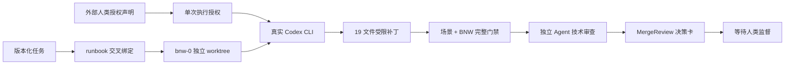

# Phase 1 首次真实 Codex 与滤波主题实施说明

## 1. 本轮结果

JobSlayer 已从源控 `TaskSpec + ValidationProfile + Runbook` 启动一次真实 Codex CLI，在 BraveNewWorld 的 `bnw-0` 固定基线上创建隔离 worktree，并完成含噪正弦与一阶低通滤波教学主题。实现经过独立验证和 Agent 技术审查，当前停在 `MergeReview`，等待人类决定。

本轮没有修改 BraveNewWorld 主 checkout，没有提交、合并、推送或部署，也没有替人类记录决定。

## 2. 真实闭环



JobSlayer 拥有工作区、授权、超时、事件归一化、路径政策、验证、制品、状态转换和完成门禁。Codex 只负责在获准工作区提出实现。

## 3. 源控输入

- 任务：`tasks/bnw-filter-demo-001.json`
- 验证配置：`validation-profiles/brave-new-world-filter-v1.json`
- 运行装配：`runbooks/bnw-filter-demo-001-codex.json`
- 测试床登记：`testbeds/brave-new-world.json`
- 固定基线：`fb43878c9f0164deef272e55969c0fc134a6d6a3` / `bnw-0`
- 仓库：`https://github.com/fangzhouRWTH/BraveNewWorld.git`

真实启动命令为：

```bash
./jobslayer run-task \
  runbooks/bnw-filter-demo-001-codex.json \
  --authorized-by fangzhou-user-request-2026-08-07
```

`--authorized-by` 是本地显式声明，不是认证身份。当前 run/workspace ID 已被使用；复现实验必须版本化新 ID，不能覆盖已有记录。

## 4. BraveNewWorld 实现

新主题包括：

- 由固定 31 位整数 seed 驱动的显式 LCG，不使用全局随机状态；
- `clean / noisy / filtered` 三条确定性轨迹；
- `α = 1 - exp(-2π fc dt)` 的稳定一阶低通精确离散更新；
- 原始与滤波 RMS 误差、改善比例、理论幅值响应 dB、理论相位延迟和采样数；
- `scenarios/noisy-low-pass.json` 无头场景；
- 根据 `demo_id` 分发但保持旧 `first-order-step` 序列化兼容的公共内核；
- 两个真实主题之间切换的极简 Canvas UI；
- 契约、PRNG、滤波系数、指标、CLI 场景和 HTTP handler 测试；
- README、架构说明、逐步日志和 BNW ADR-0002。

默认滤波场景产生 301 个采样点，轨迹哈希为 `52517134680e55ae2b21abddcb323146aa866fe2732a88cc1276bbf476dd7613`。原始 RMS 误差为 `0.4016438040`，滤波 RMS 误差为 `0.2293931742`，改善 `42.8864%`。

## 5. 运行与证据

| 项目 | 值 |
|---|---|
| run | `.jobslayer/runs/bnw-filter-demo-001-run-01` |
| worktree | `.jobslayer/workspaces/bnw-filter-demo-001-ws-01` |
| branch | `jobslayer/bnw-filter-demo-001-ws-01` |
| executor | `codex_cli` |
| 状态 | `MergeReview` |
| records / transitions | 2 / 5 |
| record/audit/artifact integrity | 全部有效 |
| Codex input tokens | 1,184,089 |
| cached input tokens | 1,106,432 |
| output tokens | 21,831 |
| reasoning output tokens | 2,510 |

规定验证：

1. `./bnw run-scenario scenarios/noisy-low-pass.json`：通过；
2. `./bnw check`：4/4 通过，28 项 unittest 通过。

JobSlayer 最终 `./jobslayer check` 为 7/7，通过 101 项 unittest、编译、依赖一致性、测试床、scripted/Codex 两套 runbook 绑定和 Git diff 门禁。

模型沙箱内首轮 `./bnw check` 发现一个真实 PRNG 固定序列期望错误，同时因沙箱禁止 socket 导致旧 loopback 集成测试无法创建监听。模型修正序列，并把自动 HTTP 覆盖改为直接驱动真实 handler。JobSlayer 随后在外层重新运行完整套件，并额外实际监听 `127.0.0.1`，完成 GET/POST 和 headless Chrome 视觉烟雾验证。

## 6. 人工监督

当前真实决定页可这样打开：

```bash
./jobslayer run-ui \
  .jobslayer/runs/bnw-filter-demo-001-run-01 \
  --actor-id local-supervisor \
  --open-browser
```

页面真实显示 low risk、`MergeReview`、五次状态转换、补丁路径、验证/补丁/审查证据和当前能力边界。页面只能创建决定文件；身份未认证，决定不会自动应用，更不会执行 Git merge、push 或部署。

BraveNewWorld 候选界面位于保留的 worktree，可运行：

```bash
cd .jobslayer/workspaces/bnw-filter-demo-001-ws-01
./bnw ui --open-browser
```

## 7. 当前边界与下一步

- 主 checkout 仍是干净的 `bnw-0`；候选补丁只存在于受治理 worktree。
- `workspace-write` 拦截了模型侧 socket 创建，但 JobSlayer 尚无独立 OCI/VM 证明，因此能力仍如实标记为无网络/资源强隔离。
- 本轮只有事后 token usage，没有执行前 token/cost 强制预算；不应立即扩大到无人值守批量运行。
- controller 当前只允许一次尝试；验证失败会进入 `Repairing`，但不会自动启动下一次模型修复。
- 人类决定应用需要外部有效 `ApprovalAuthority`。后续框架已由 ADR-0012 把批准改为 `Integrating`，并提供另行显式调用、证据门禁的本地 fast-forward；该真实 run 尚未记录决定，仍未提交或集成。

建议下一次讨论先决定：是否接受并整合该 BNW 候选补丁；随后在“有界修复循环、执行前预算、外层隔离”中选择一个作为 JobSlayer 下一纵向切片。
