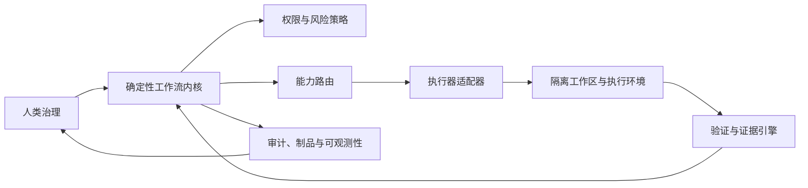
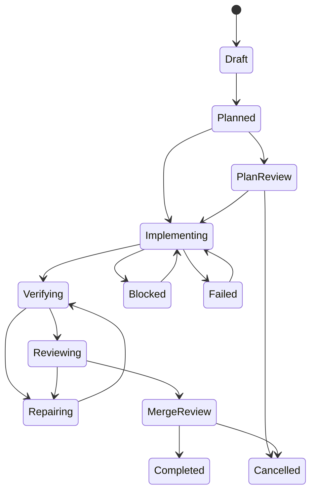

# JobSlayer 项目开发指导

## 1. 文档定位

本文把《Development Guide for an AI-Collaborative Engineering Platform》的架构建议转化为本仓库可执行的工程规则。它是当前开发、评审和范围判断的首要指导；原策划文档负责提供生态调研和长期参考，本文件负责约束 JobSlayer 的实际实现。

## 2. 产品定义

JobSlayer 不是通用“自治软件团队”，也不是多个 Agent 自由会话的包装器。它是复杂软件工程的受治理控制平面，首要服务于 C++/Python、图形、仿真、机器人、合成数据和训练类项目。

平台负责把一个批准的需求转换成以下可审计闭环：

```text
类型化任务 -> 计划与审批 -> 隔离执行 -> 确定性验证
          -> 有界修复 -> 独立评审 -> 人或策略批准 -> 合并提案
```

平台必须始终回答四个问题：

1. 谁在什么上下文和权限下做了什么？
2. 产生了哪些源码、日志、二进制、图像、数据集或报告？
3. 哪些可重复的证据支持任务已满足验收标准？
4. 谁或哪条明确策略批准了下一步？

## 3. 不可破坏的架构原则

### 3.1 代码拥有控制权

LLM 和编码 Agent 可以解释任务、提出计划、编辑隔离工作区、运行获准命令并生成结构化结论。它们不能：

- 修改自己的验收标准、预算或权限；
- 跳过、删除或覆盖失败的检查；
- 直接把任务从实现中标记为完成；
- 自行扩大文件、网络、密钥或部署范围。

合法状态转换、重试、升级、取消和完成判定只能由确定性工作流内核执行。

### 3.2 拥有领域模型，复用外部运行时

仓库拥有 `TaskSpec`、`AgentRunSpec`、`RunEvent`、`ArtifactManifest`、`VerificationReport`、审批与决策模型。Codex、OpenHands、PydanticAI、Dagger、Temporal、Ray 等均是可替换适配器或下层基础设施，不能反向塑造公开领域 API。

### 3.3 证据高于叙述

“Agent 认为完成”不是完成条件。通过的编译、测试、渲染对比、仿真不变量、性能预算及其日志和哈希才是证据。失败记录不可擦除；修复后应追加新的验证报告。

### 3.4 先闭环，再扩展

首个目标是让一个真实且范围窄的任务完成“任务定义—隔离补丁—验证—人工合并审批”闭环。数据库、Web UI、多 Agent、GPU 集群和 Kubernetes 都不能替代这个闭环。

## 4. 系统边界



### 控制平面（本项目拥有）

- 项目、任务、运行、制品、验证、审批和决策契约；
- 工作流状态与转换政策；
- 能力、风险、预算和权限策略；
- 上下文包版本与哈希；
- 验证配置和完成判定；
- 面向人的决策界面和项目视图。

### 执行平面（通过适配器复用）

- Codex CLI/SDK、OpenHands 等编码执行器；
- Git worktree 和 OCI/Dagger 沙箱；
- CI、Ray 以及未来的集群任务系统；
- Langfuse/Phoenix、MLflow、OpenTelemetry 等观测后端。

## 5. 领域契约

首批契约位于 `src/jobslayer/domain/models.py`：

| 契约 | 作用 | 关键约束 |
|---|---|---|
| `TaskSpec` | 一次工程任务的版本化输入 | 明确仓库、基线、路径范围、验收条件、风险与预算 |
| `AgentRunSpec` | 某执行器的一次受控运行 | 固定上下文包、工作区、权限、时限和输出模式 |
| `RunEvent` | 统一的运行事件 | 同一运行内顺序号唯一且递增 |
| `ArtifactManifest` | 制品及其来源 | 记录类型、URI、内容哈希和生产者 |
| `VerificationReport` | 检查结果集合 | 区分必需检查、失败、回归和未解决风险 |
| `TransitionRecord` | 工作流审计记录 | 记录前后状态、行为者、理由、证据与哈希链 |

契约演进规则：

- 字段新增优先保持向后兼容；破坏性变化必须提升 schema 版本；
- 不存放任何提供方 SDK 对象；
- 所有可变集合使用独立默认值；
- 标识符、时间和哈希必须可序列化并可稳定重放；
- 验收标准变化产生新的 `TaskSpec` 版本，不原地改写历史。

## 6. 确定性工作流

初始软件变更状态机：



强制规则：

- 每次转换记录行为者、理由、时间和证据引用；
- 进入 `Reviewing` 必须附带通过的 `VerificationReport`；
- 进入 `Completed` 必须由 `human` 或获准的 `policy` 行为者执行，并再次引用通过的验证报告；
- `agent` 无权完成或取消任务；
- 非法转换不写入日志；
- 后续重试创建新证据，不修改旧证据。

当前 JSONL 日志是单进程研究实现：哈希链可以发现内容改写或链断裂，但不能抵抗拥有文件系统权限的攻击者重写整条链或删除尾部。进入多控制器或生产阶段前，必须迁移到具备事务序列、访问控制、备份和外部锚定/保留策略的存储；不能把本地文件称为密码学不可变账本。

## 7. 安全与工作区规则

所有可写任务最终必须运行在“一任务一工作区”中：固定基线提交、独立 worktree/分支、任务级容器、只挂载获准路径、限制网络和资源、使用短期凭据、捕获完整输出并能取消整个进程树。

最小权限需要分离为：读、写、执行、网络、密钥、合并和部署。任何提权都要暂停工作流并创建明确的人工决策。编码 Agent 所在的作业不得同时持有生产部署凭据或仓库管理令牌。

仓库、Issue、网页、MCP 工具描述与输出、模型输出和第三方插件默认均视为不可信输入。

## 8. 验证与完成定义

验证按风险逐层增加：

1. schema、格式和静态检查；
2. 编译和单元测试；
3. 集成及场景测试；
4. 图形捕获、仿真不变量、确定性和性能测试；
5. 独立 Agent 评审；
6. 需要时的人类架构或产品判断。

一个功能或任务只有同时满足下列条件才算完成：

- 验收标准均可映射到至少一项证据；
- 所有必需检查通过，且没有检测到回归；
- 未解决风险已被关闭，或由有权行为者显式接受；
- 源提交、上下文、命令、环境和制品可追溯；
- 工作流到达 `Completed`，且转换符合审批策略；
- 相关文档和测试已同步更新。

## 9. 代码组织约定

```text
src/jobslayer/domain/      提供方无关的契约
src/jobslayer/workflow/    状态机、政策和审计日志
src/jobslayer/adapters/    外部 Agent、作业和存储适配器（后续）
src/jobslayer/verification/验证配置和执行（后续）
docs/adr/                  架构决策记录
examples/                  可复制、无敏感信息的输入示例
tests/                     确定性单元和集成测试
```

新增外部依赖前要回答：它解决了哪个已观察到的问题、能否被现有接口替换、移除成本是什么、怎样用内部基准证明收益。

## 10. 决策和变更流程

涉及领域契约、工作流含义、权限边界、制品真相来源或基础设施引入的改动必须新增或更新 ADR。每个 ADR 至少记录：背景、决定、理由、后果、替代方案和退出策略。

每月轻量检查依赖发布、弃用、安全与许可证变化；每季度根据内部任务的成功率、干预率、成本和回归结果决定是否升级、替换或移除适配器。

## 11. 当前实施基线

当前代码已建立 Phase 0 的三项地基：类型化契约、确定性状态机、可校验追加日志。下一步不是增加更多角色，而是接入一个真实 Git worktree、一个受限 Codex CLI 执行器，以及一个仓库中可重复运行的验证命令，完成首个真实闭环。详细顺序见 [ROADMAP.md](ROADMAP.md)。
