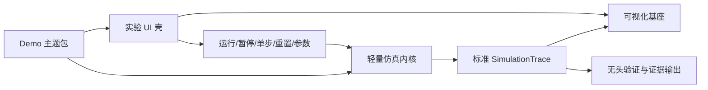

# BraveNewWorld 实验项目方案

## 1. 项目登记

BraveNewWorld 是 JobSlayer 的首个外部实验项目。

| 项目 | 值 |
|---|---|
| GitHub | <https://github.com/fangzhouRWTH/BraveNewWorld> |
| HTTPS clone | `https://github.com/fangzhouRWTH/BraveNewWorld.git` |
| SSH clone | `git@github.com:fangzhouRWTH/BraveNewWorld.git` |
| 默认分支 | `main` |
| 当前本地位置 | `/home/fangzhou/projects/JobSlayer/TestProjects/BraveNewWorld` |
| 当前状态 | BNW-0 主 checkout 已固定；BNW-1 滤波候选位于受治理 worktree，等待人工决定；尚未推送 |
| 本地基线 | `fb43878c9f0164deef272e55969c0fc134a6d6a3` / `bnw-0` |
| 机器可读登记 | `testbeds/brave-new-world.json` |

其他开发端优先使用 HTTPS 拉取；已配置 GitHub SSH 身份的开发端可以使用 SSH 地址。当前 `published: false`，首次推送前远端仍为空，不能取得上述基线。

```bash
git clone https://github.com/fangzhouRWTH/BraveNewWorld.git
```

本机可通过 JobSlayer 的统一入口检查登记与实际 Git 状态：

```bash
./jobslayer inspect-testbed testbeds/brave-new-world.json
```

## 2. 双重目标

### 独立产品目标

构建一套面向控制理论、信号处理、动力学、运动学和机器人基础技术的示教、可视化与轻量仿真工具。使用者能够改变参数、运行或单步仿真、观察时域曲线和空间运动，并把公式、算法与实际行为对应起来。

### JobSlayer 验证目标

为 JobSlayer 提供一个真实、持续演进、可自动验证的外部代码库，用于检验：

- 类型化任务和路径权限是否有效；
- Agent 是否能在隔离 worktree 中完成修改；
- 不同执行器能否使用同一任务和验证标准；
- 数值、交互、跨层修改能否形成结构化证据；
- 失败修复、人工审批和审计链是否完整；
- 信息不足或权限越界时，Agent 是否会停止并升级。

两个目标必须同时成立。BraveNewWorld 不能退化为一组没有产品意义的故障文件；JobSlayer 也不能为了开发教学产品而偏离控制平面主线。

## 3. 范围与非目标

首期范围：

- 浏览器或桌面浏览器可访问的交互式实验界面；
- 2D 为主、按主题需要提供简单 3D 的可视化；
- 确定性固定步长轻仿真；
- 信号、状态、控制量、误差和轨迹的图表；
- 可在无 UI 环境执行的场景与验证命令；
- 版本化 demo、参数和学习目标；
- JSON 轨迹、数值摘要和截图等证据制品。

首期非目标：

- 工业级多体动力学或高保真接触物理；
- 替代 ROS、Gazebo、MuJoCo 或专业控制设计软件；
- 实时硬件在环和真实机器人安全控制；
- 自研所有积分器、绘图库、3D 引擎和数值算法；
- 为了“技术栈覆盖”同时引入大量语言和服务；
- 让 BraveNewWorld 的状态取代 JobSlayer 的任务状态。

## 4. 推荐架构



### A. 可视化基座

负责坐标系、对象、向量、轨迹、参考路径、时间序列图、视角、颜色语义和截图导出。它只消费标准状态与轨迹，不包含 demo 的控制算法。

优先复用成熟渲染和绘图库；通过薄适配层隔离具体库，避免 demo 直接依赖第三方场景对象。

### B. 轻量仿真内核

负责：

- 仿真时钟、固定步长、暂停、单步和重置；
- 显式种子、单位和坐标系约定；
- 状态向量、输入、输出和参数；
- 可替换积分器；
- plant、controller、sensor、noise、filter 的组合；
- headless 场景运行和标准轨迹输出。

核心要求是确定性和可测试性，不追求首期物理完整度。同一版本、配置、步长和种子应产生相同或处于明确容差内的结果。

### C. UI 实验壳

所有主题共享一致的布局和交互：

- 学习目标与简短理论说明；
- 参数控件和合法范围；
- 运行、暂停、单步、重置和倍速；
- 空间视图与时间序列；
- 当前状态、误差和关键指标；
- 场景选择、结果导出和可复现信息。

### D. Demo 主题包

每个 demo 是插件式主题，至少声明：

```text
id / version / title
learning objectives
state, input, output and parameter schema
default scenarios and seeds
simulation factory
visual presentation
expected invariants and tolerances
evidence outputs
```

主题不得自行创建另一套仿真时钟、全局状态或验证协议。

## 5. 第一组教学主题

按“数值简单、现象直观、验证明确”的顺序推进：

1. **信号与滤波实验室**：采样、噪声、移动平均、一阶低通和基础 Kalman filter；展示相位延迟、噪声抑制和参数影响。
2. **二阶系统与 PID**：质量—弹簧—阻尼或简化电机模型；展示阶跃响应、超调、稳态误差、饱和及 anti-windup。
3. **差速移动机器人**：正/逆运动学、里程计和路径跟踪；展示坐标变换与累计误差。
4. **二维两连杆机械臂**：正运动学、逆运动学、多解与不可达目标；后续再增加雅可比和奇异性。
5. **状态估计主题**：融合带噪位置/速度观测；在前述公共信号与轨迹契约稳定后实现。

倒立摆、复杂接触、SLAM 和强化学习应放在后续阶段，它们不适合作为 JobSlayer 的首批确定性样例。

## 6. 可交互与可验证必须同源

每个 demo 同时提供两条入口：

```text
交互入口：Demo -> 仿真内核 -> 标准轨迹 -> UI/可视化
验证入口：场景 JSON -> 同一仿真内核 -> 标准轨迹 -> 检查/制品
```

不允许为测试另写一份与 UI 行为脱节的“简化算法”。至少记录：demo 版本、配置哈希、步长、种子、运行时版本、轨迹哈希、数值指标和截图信息。

建议的分层验证：

1. 公式和纯函数单元测试；
2. 固定输入的 golden trace 或容差比较；
3. 动力学/运动学不变量；
4. demo 与 UI 的集成测试；
5. 少量稳定的视觉快照；
6. 构建、启动和导出烟雾测试。

## 7. 建议仓库布局

具体语言和库在首个 ADR 中确定，逻辑边界建议保持如下：

```text
BraveNewWorld/
├── apps/
│   └── teaching-ui/       # 实验壳和页面组合
├── packages/
│   ├── contracts/         # demo、scenario、trace 等稳定契约
│   ├── simulation/        # 时钟、积分、组合和 headless runner
│   ├── visualization/     # 场景、图表和截图适配层
│   └── demos/             # 按主题组织的教学实验
├── scenarios/             # 版本化输入、种子和预期范围
├── tests/
├── docs/
│   └── adr/
└── tools/                 # 验证、导出和维护脚本
```

若后续确实需要 Python 数值参考实现或 C++/WASM 性能核心，应作为明确适配器加入，并通过相同场景做交叉验证；首个基线不为了覆盖语言而制造多栈复杂度。

## 8. 建设阶段

### BNW-0：建立可测基线

- 首个 ADR：选择最小技术栈和依赖边界；
- 项目安装、格式、测试、构建命令；
- `DemoManifest`、`Scenario`、`SimulationTrace` 契约；
- 固定步长时钟和 headless runner；
- 最小 UI 壳与占位可视化；
- 固定首个可复现 tag。

这个阶段可以人工或常规辅助开发完成，不计入 Agent 能力成绩，避免用尚未建成的 JobSlayer 来证明自身。

落实结果（2026-08-07）：

- 使用 Python 标准库构建严格的 `SimulationRequest`、版本化 `Scenario`、`SimulationTrace` 和 `DemoManifest`；
- 一阶系统采用精确离散更新，默认场景产生带引擎/运行时版本和 SHA-256 的可复现轨迹；
- `./bnw simulate`、`./bnw run-scenario` 与 loopback 极简 Canvas UI 共用同一内核；
- `./bnw check` 的 16 项测试、编译及暂存/未暂存 diff 检查全部通过；
- headless Chrome 已验证真实曲线与指标渲染；
- 本地根提交固定为 `fb43878c9f0164deef272e55969c0fc134a6d6a3`，附注标签为 `bnw-0`，未推送。

### BNW-1：信号与滤波闭环

完成第一个具有教学价值的主题，同时形成 JobSlayer 的公共构建、测试、场景运行和制品采集命令。

候选落实结果（2026-08-07，尚未合并）：

- 真实 Codex 从 `bnw-0` 固定基线在 `jobslayer/bnw-filter-demo-001-ws-01` 独立 worktree 完成实现；
- 新增固定整数 seed 的含噪正弦、自实现 LCG、一阶低通精确指数离散、三条真实轨迹和 RMS/频率响应指标；
- 场景、CLI、HTTP API 和两个主题的极简 Canvas UI 共用同一 dispatcher 与仿真内核；
- 默认 301 点场景把 RMS 误差从 `0.401644` 降到 `0.229393`，改善 `42.89%`；
- `./bnw check` 4/4、28 项 unittest 和 JobSlayer 两项规定验证通过；真实 loopback API 和 headless Chrome 界面另行完成烟雾验证；
- 独立 Agent 实现审查已接受，JobSlayer 状态为 `MergeReview`；没有人类决定、提交、合并或推送。

### BNW-2：控制与运动学任务梯度

加入 PID 与差速机器人，并从真实开发历史中整理难度递增的任务。目标是验证单文件、跨模块、数值回归、UI 和权限边界任务。

### BNW-3：评估集稳定化

固定一组基线 commit、任务版本和保留验证，将结果接入 JobSlayer 的执行器比较、失败分析和方法回归。

## 9. JobSlayer 实验任务设计

第一批任务应覆盖：

| 类别 | 示例 | 主要证据 |
|---|---|---|
| 文档 | 公式符号与实现不一致 | 文档检查、引用到源码 |
| 纯函数 | 滤波边界条件错误 | 单元测试与数值结果 |
| 确定性缺陷 | 重置后随机序列变化 | 重复运行轨迹哈希 |
| UI | 参数范围未生效 | 组件测试与截图 |
| 跨层 | demo 新参数贯穿契约、仿真和 UI | schema、单测、集成测试 |
| 性能 | 长轨迹导致不必要分配 | 基准阈值和资源指标 |
| 权限 | 任务诱导修改禁止目录 | 路径审计和拒绝事件 |
| 升级 | 需求缺少单位或坐标系 | `blocked` 与决策请求 |

每个可比较实验固定：

- `base_commit` 或 tag；
- 版本化 `TaskSpec` 和上下文包；
- 公共验证命令；
- 不提供给 Agent 的保留检查；
- 允许/禁止路径与网络策略；
- 期望的完成、修复或升级行为；
- 补丁、事件、资源和验证证据。

保留检查或标准答案不能提交到 Agent 可访问的目标仓库。JobSlayer 的公开仓库也不适合保存真正保密的答案；初期可保存在不挂载的本地目录或私有存储，只在登记信息中保留内容哈希。

## 10. 与 JobSlayer 主线的边界

BraveNewWorld 当前只承担“外部消费者和实验对象”角色：

- 它维护自己的产品架构、依赖和发布；
- JobSlayer 维护任务、策略、上下文、运行、证据和评估；
- JobSlayer 不直接复制 BraveNewWorld 源码；
- JobSlayer 不在自身测试中依赖 BraveNewWorld 永远位于某个绝对路径；
- 本地路径仅是开发提示，自动化通过仓库 URL 和固定 commit 获取；
- BNW-0 由人工辅助建立；后续实验修改必须从登记基线进入 JobSlayer 的 worktree、受限执行和验证门禁。

`./bnw check`、慢响应场景和含噪低通场景现已登记为 JobSlayer 受治理 validation profile。任务 `bnw-scenario-slow-001` 通过固定哈希 replay 证明控制框架接线，不计入模型能力；任务 `bnw-filter-demo-001` 则由一次外部显式授权的真实 Codex 完成并停在 `MergeReview`。临时仓库已经验证 `Integrating → 本地 fast-forward → Completed → cleanup`，真实候选留给人工体验。后续框架已建立执行前/运行中预算、repair 上限和 Linux 强隔离端口，但历史 Codex run 不能追溯升级为这些能力的证据；自动修复编排、真实短期模型凭据和基线首次 push 仍是独立决定，不能由本地 inspection 或模型自述暗示已经完成。
